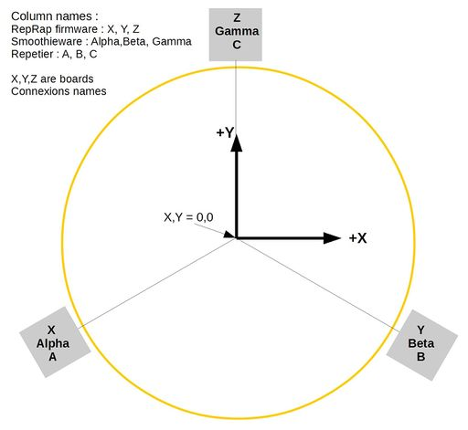
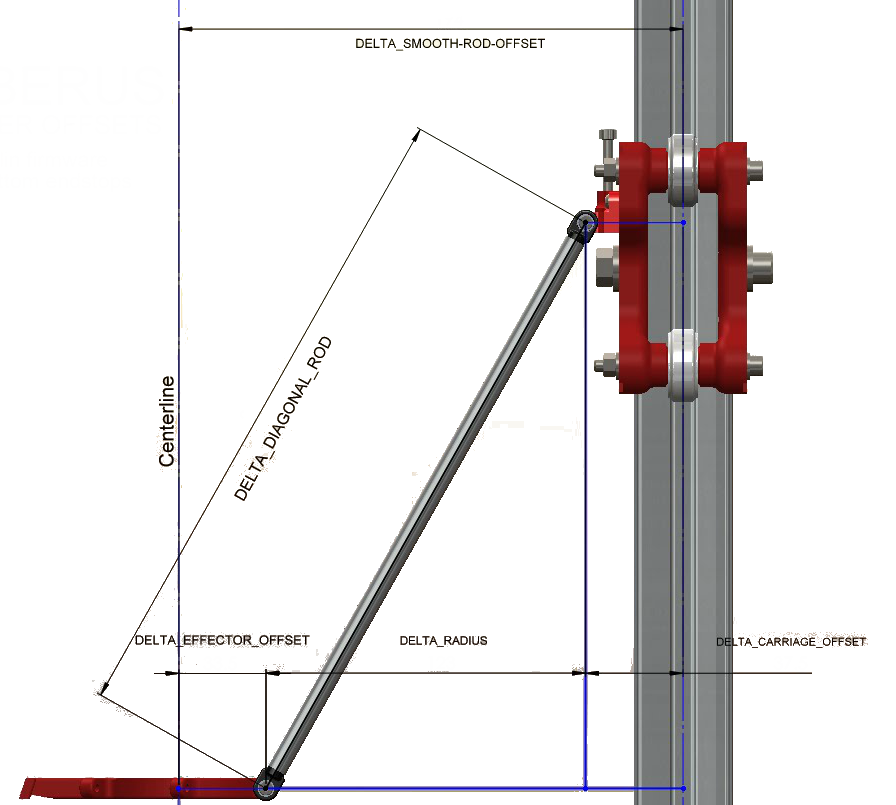
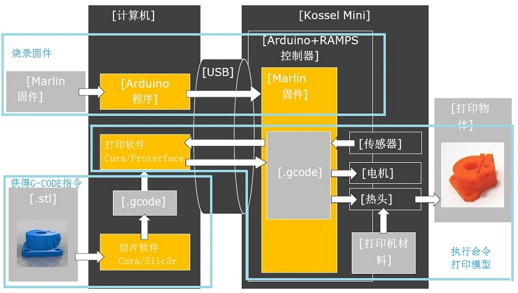

# Basic







# Hardware Adjustment

皮带松紧调节：保持松紧度一致，用调琴弦的方式，调节到三根皮带的震动音调一致。

# Software

## Arduino

Install [Arduino IDE](https://www.arduino.cc/)

On Tools menu, select board: MEGA 2560 and port. 

## Firmware

[Marlin](http://marlinfw.org/) firmware for RepRap family printers. ([github](https://github.com/MarlinFirmware/Marlin))

Double click `Marlin/Marlin.ino` file to open project in Arduino IDE.

### Config

测量杆长：

* `DELTA_DIAGONAC_ROD` = 214.0

测量三个轴滑车均到达最高点时挤出头离打印床的距离，稍微减少一些作为调平余量：

* `DELTA_HEIGHT` = 250.0

发 `G1 X0 Yn` 试验`n`可以达到的最大值，测试可打印半径：

- `DELTA_PRINTABLE_RADIUS` = 85.0

计算各轴电机走1mm需要的脉冲数：XYZ轴使用 [Prusa Printers Calculator](https://www.prusaprinters.org/calculator/) 计算(1.8°步进，GT2同步轮齿距2mm，16齿，RAMPS为1/16 microstepping)；E轴根据挤出轮直径12mm，算出周长37.7mm，步进电机转一周3200个脉冲（与XYZ轴计算类似），得到每mm脉冲数84.88

* `DEFAULT_AXIS_STEPS_PER_UNIT` = { 100, 100, 100, 84.88 }

## Slicer 

Slicers prepare a solid 3D model by dividing it up into thin slices (layers). In the process it generates the G-code base on printer parameters.

* [Slic3r](http://slic3r.org/)

## Printing Host

3D printing host software. Communicate with the printer to control and send G-codes.

* [Printrun](https://github.com/kliment/Printrun) pronterface

## Modeling

* [OpenSCAD](http://www.openscad.org/), programmers solid 3D CAD modeller

## Other Resources

* [Prusa Printer Calculator](https://www.prusaprinters.org/calculator/)

# LCD

* X Y Z indicators blink: homing is needed, send a `G28`

# G-Codes

List of G-codes can be found in [RepRap](http://reprap.org/wiki/G-code) and [Marlin](http://marlinfw.org/meta/gcode/) (only implements a subset).

## Common Used G-Codes

| Code                                     | Command                   | Description                              |
| ---------------------------------------- | ------------------------- | ---------------------------------------- |
| `G0 [X<pos>] [Y<pos>] [Z<pos>] [F<rate>]` | Linear move               | F: maximum movement rate (mm/min)        |
| `G1 [X<pos>] [Y<pos>] [Z<pos>] [E<pos>] [F<rate>]` | Linear move               | E: lenght of filament to feed into the extruder |
| `G28 [X] [Y] [Z]`                        | Move to home              |                                          |
| `G30 X<pos> Y<pos>`                      | Single Z probe            |                                          |
| `G33 P<n>`                               | Delta auto calibration    | P: number of probe points (n*n). Recommended: 1/2/5/10 |
| `M84 [S<sec>]`                           | Stop idle hold            | S: idle the stepper motors after several seconds. |
| `M106 [Snnn]`                            | Fan on                    | 0~255, no speed sets the fan to full speed |
| `M107`                                   | Fan off                   |                                          |
| `M114`                                   | Get current position      |                                          |
| `M119`                                   | Get endstop states        | Report as either "open" or "TRIGGERED"   |
| `M500`                                   | Save settings             | Save current settings to EEPROM          |
| `M501`                                   | Load settings             | Load settings from EEPROM                |
| `M502`                                   | Reset settings            | Reset all settings to firmware default   |
| `M503`                                   | Report settings           | Report all current settings              |
| `M665 [Bnnn] [Hnnn] [Lnnn] [Rnnn] [Sfff] [Xfff] [Yfff] [Zfff]` | Delta configuration       |                                          |
| `M666 [Xfff] [Yfff] [Zfff]`              | Delta endstop adjustments | Negative endstop corrections move the head closer to the bed (unit:mm) |

```
G0 X0 Y0 Z1 F3000      <- center -->
G0 X80 Y0 Z1 F3000     <- x ->
G0 X-80 Y0 Z1 F3000    <- -x ->
G0 X0 Y80 Z1 F3000     <- y ->
G0 X0 Y-80 Z1 F3000    <- -y ->
```